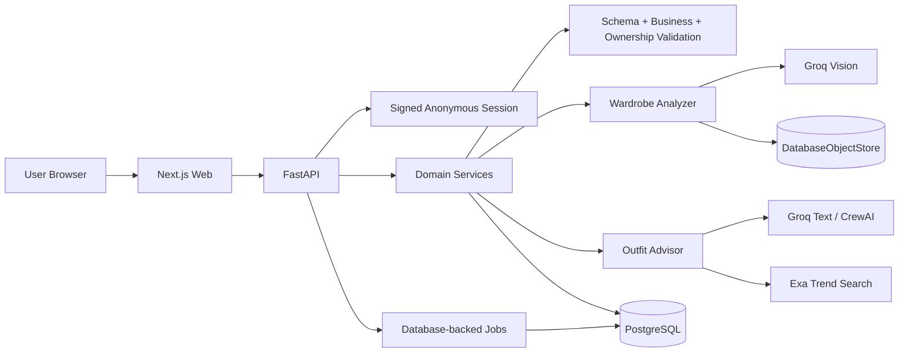

# STYLELAB

### AI wardrobe intelligence for the clothes you already own.

**Upload what you own → let AI understand it → correct uncertainty → compose outfits → swap pieces.**

[](https://github.com/theShivansh/StyleLab/actions/workflows/ci.yml)
[](LICENSE)

STYLELAB turns photographs of your own clothes into a structured wardrobe and generates outfit recommendations grounded in that wardrobe.

It is deliberately **not** a shopping assistant, merchant catalogue, or generic chatbot.

The database knows what you own.  
The vision model understands garments.  
You correct uncertainty.  
The AI ranks and explains combinations.  
The application validates what is allowed to reach the user.

---

## Why STYLELAB?

Most AI styling experiences have a simple problem:

> The model can recommend something that sounds good but does not exist in your closet.

STYLELAB treats wardrobe ownership as a product invariant.

Instead of:

> “Try a black leather boot.”

STYLELAB asks:

> “Which footwear from this user's actual wardrobe best completes this look?”

That changes the architecture.

```text
User photos
    ↓
Vision extraction
    ↓
Structured wardrobe
    ↓
Human correction
    ↓
Ownership-scoped candidate retrieval
    ↓
AI styling
    ↓
Schema validation
    ↓
Business validation
    ↓
Ownership validation
    ↓
Outfit

---
```
# Product Loop

```text
UPLOAD
   ↓
UNDERSTAND
   ↓
CORRECT
   ↓
COMPOSE
   ↓
SWAP
   ↓
SAVE / SHARE
```

### 1. Upload

Upload multiple photographs of clothes you own.

Each image is processed independently so one failed image does not have to break the entire wardrobe capture.

### 2. Understand

The vision pipeline extracts structured garment metadata such as:

* category
* color
* pattern
* fit
* sleeve information
* occasion information
* material estimates
* per-field confidence

### 3. Correct

AI uncertainty is visible.

A field can move from:

```text
AI:
color = black
confidence = low
```

to:

```text
User:
Actually navy.
```

and become canonical wardrobe state:

```text
color = navy
source = user_corrected
```

This is persistent user feedback, not online model training.

### 4. Compose

The application retrieves garments that the user actually owns.

The model can rank and explain those candidates, but it cannot simply invent a wardrobe item.

### 5. Swap

“What if I change the bottom?”

STYLELAB changes one wardrobe slot while preserving the rest of the look.

The swap path is intentionally narrower than a full composition so it avoids paying for the entire advisory stack again.

---

# The Core Differentiator: Grounded AI

## The model is not the source of truth.

```text
                 ┌──────────────────────┐
                 │   User Garment Photo │
                 └──────────┬───────────┘
                            ↓
                 ┌──────────────────────┐
                 │    Vision Model      │
                 └──────────┬───────────┘
                            ↓
                 ┌──────────────────────┐
                 │ Schema Validation    │
                 └──────────┬───────────┘
                            ↓
                 ┌──────────────────────┐
                 │ Business Validation  │
                 └──────────┬───────────┘
                            ↓
                 ┌──────────────────────┐
                 │ Human Correction     │
                 └──────────┬───────────┘
                            ↓
                 ┌──────────────────────┐
                 │ Canonical Wardrobe   │
                 └──────────┬───────────┘
                            ↓
                 ┌──────────────────────┐
                 │ Owned Candidates     │
                 └──────────┬───────────┘
                            ↓
                 ┌──────────────────────┐
                 │ AI Ranking / Advice  │
                 └──────────┬───────────┘
                            ↓
                 ┌──────────────────────┐
                 │ Final Validation     │
                 │ Schema               │
                 │ Business             │
                 │ Ownership            │
                 └──────────┬───────────┘
                            ↓
                       Accepted Look
```

The LLM produces **untrusted data**.

The application decides whether that data is allowed to become a recommendation.

This prevents a confident model response from becoming an automatic product decision.

---

# Human-in-the-Loop AI

STYLELAB explicitly separates:

| State              | Meaning                                                     |
| ------------------ | ----------------------------------------------------------- |
| **Observed**       | What the vision pipeline extracted from the photograph      |
| **Inferred**       | A model-derived interpretation represented with uncertainty |
| **User-confirmed** | A value explicitly corrected by the wardrobe owner          |

### Example

```text
Model inference
color = black
confidence = 0.31

        ↓

User correction
"Actually navy."

        ↓

Canonical state
color = navy
source = user_corrected
```

That corrected state is then available to the recommendation system.

The system does **not** pretend that a correction retrains the underlying model.

---

# Multi-Agent Advisory Layer

The composition system uses specialist roles rather than one enormous prompt.

| Agent                 | Responsibility                                                      |
| --------------------- | ------------------------------------------------------------------- |
| **Wardrobe Analyst**  | Extract garment metadata and confidence                             |
| **Style Profiler**    | Build an aesthetic profile from wardrobe + explicit preferences     |
| **Trend Scout**       | Map dated, source-grounded trends onto owned garments               |
| **Outfit Architect**  | Build candidate combinations                                        |
| **Critic**            | Pressure-test palette, proportion, occasion and weather             |
| **Practical Advisor** | Provide styling tips, alternatives, budget tricks and wardrobe gaps |
| **Editor**            | Merge structured outputs into the final advisory contract           |

### Execution

```text
Style Profiler ─┐
                ├──> Outfit Architect ──┬──> Critic ──────┐
Trend Scout ────┘                      └──> Practical ────┤
                                                        ↓
                                                      Editor
```

The parallelism is deliberate.

Not every step needs to wait for every other step.

---

# Why Not a Generic ReAct Loop?

STYLELAB deliberately avoids an unconstrained:

```text
Thought → Action → Observation → Thought → Action → ...
```

loop.

The domain already gives us deterministic decisions that should not be delegated to an LLM:

* ownership
* candidate retrieval
* item existence
* item state
* core compatibility constraints

A bounded orchestration model provides:

* predictable latency
* predictable token usage
* clearer security boundaries
* simpler failure handling
* easier evaluation
* easier debugging

There **is** one bounded refinement loop.

The Critic can trigger a revision when its score is below the configured threshold and actionable objections exist.

That revision is capped.

The goal is controlled reasoning, not infinite agent theatre.

---

# Trend Grounding

Trend information is treated as a **styling signal**, not as inventory.

```text
Trend Source
    ↓
Date filtering
    ↓
Editorial-domain filtering
    ↓
Commerce filtering
    ↓
Attributed trend context
    ↓
Trend Scout
    ↓
Owned wardrobe
```

The core rule is:

> **Trends may rerank garments you own. Trends may never introduce garments you do not own.**

Trend notes without valid attribution are dropped rather than rendered.

Trend retrieval is optional. Without the configured Exa key, STYLELAB can continue composing from the wardrobe with reduced advisory depth.

---

# AI Reliability — The “No-Gimmick” Layer

STYLELAB tests what happens when the model is **wrong**, not only when it is helpful.

Current evaluation categories include:

* unowned garment injection
* cross-user garment injection
* IDs outside the candidate set
* malformed JSON
* schema violations
* business-rule violations
* prompt injection
* provider timeout
* provider failure
* retry/fallback behavior
* low-confidence extraction
* insufficient wardrobe
* deleted garments
* correction persistence
* multi-agent ablation

The critical invariant is:

```text
LLM response
      ↓
Schema validation
      ↓
Business validation
      ↓
Ownership validation
      ↓
Accepted result
```

A model can produce a perfectly formatted answer and still be rejected.

---

# Failure & Degradation Strategy

STYLELAB prefers a shallower answer over fabricated confidence.

```text
1. Full advisory crew
        ↓
2. Crew without Trend Scout
        ↓
3. Architect + Editor
        ↓
4. Deterministic ranker
        ↓
5. Honest wardrobe / capability gap
```

This means:

**AI failure does not become hallucinated inventory.**

The product can reduce intelligence depth while preserving the ownership invariant.

---

# Analytics & Product Thinking

STYLELAB treats analytics as part of the product architecture.

### Funnel

```text
Landing
   ↓
Wardrobe Started
   ↓
Images Selected
   ↓
Upload / Rejection
   ↓
Extraction
   ↓
Correction
   ↓
Compose
   ↓
Outfit Viewed
   ↓
Swap / Regenerate
   ↓
Save / Share
   ↓
Session Completed
```

### Diagnostic dimensions

The event model is designed to answer **why** something failed:

```text
Failure
├── photo validation
├── extraction confidence
├── provider failure
├── schema failure
├── ownership rejection
├── latency
├── missing wardrobe role
└── abandonment
```

This supports product questions such as:

> Are users leaving because AI is bad?

or

> Are users leaving because uploading the first five garments is too difficult?

Those are very different product problems.

---

# Engineering Evidence

Latest repository verification records:

| Evidence                   |        Value | Status        |
| -------------------------- | -----------: | ------------- |
| Backend tests              |      **690** | Test-verified |
| AI evaluation tests        |      **109** | Test-verified |
| Web unit tests             |       **82** | Test-verified |
| Browser E2E                |       **66** | Test-verified |
| Agent ablation             | **11 tests** | Test-verified |
| Refusal checks             |    **19/19** | Test-verified |
| Full-crew live measurement |    **11.7s** | Measured      |
| Architect + Editor         |     **4.4s** | Measured      |

The latency measurements are environment/provider dependent and should not be interpreted as universal benchmarks.

---

# Evidence-Based Engineering Achievements

### Grounding

**Accomplished deterministic wardrobe grounding as measured by adversarial ownership tests, by constraining recommendations to server-retrieved wardrobe candidates and re-validating ownership after generation.**

### Human-in-the-loop

**Accomplished human-correctable garment extraction as measured by correction-persistence tests, by treating user corrections as authoritative wardrobe state.**

### Async processing

**Accomplished independent image-processing failure isolation as measured by async pipeline tests, by processing garments as independent analysis jobs.**

### Reliability

**Accomplished provider-failure resilience as measured by retry/fallback and degradation tests, by isolating providers behind explicit adapters.**

### Security

**Accomplished cross-user refusal behavior as measured by adversarial ownership tests, by making foreign wardrobe references a hard failure.**

### Agent evaluation

**Accomplished multi-agent value validation as measured by the ablation suite, by requiring retained roles to materially change output.**

### Privacy

**Accomplished privacy-preserving image ingestion as measured by ingest checks, by stripping EXIF metadata including GPS before persistence.**

---

# Security & Privacy

STYLELAB treats uploaded wardrobe photography as sensitive.

Controls include:

* provider secrets stay server-side
* signed anonymous sessions
* ownership-scoped queries
* cross-user item rejection
* image MIME/size/resolution validation
* EXIF/GPS stripping
* short-lived image capabilities
* access-log redaction
* model output treated as untrusted data
* prompt-injection defenses
* documented deletion and retention behavior
* no inference about people appearing in garment photographs

See [`docs/SECURITY-PRIVACY.md`](docs/SECURITY-PRIVACY.md).

---

# Architecture



For deeper architectural documentation:

[`docs/ARCHITECTURE.md`](docs/ARCHITECTURE.md)

---

# Technology Stack

| Layer            | Technology                |
| ---------------- | ------------------------- |
| Web              | Next.js 16.3.5            |
| UI               | React 19.2.8              |
| Language         | TypeScript                |
| Styling          | Tailwind CSS 4            |
| State            | Zustand                   |
| Validation       | Zod                       |
| Backend          | FastAPI                   |
| Runtime          | Python 3.11               |
| AI               | Groq                      |
| Agent framework  | CrewAI                    |
| Trend retrieval  | Exa + HTTPX               |
| Database         | PostgreSQL                |
| Storage          | DatabaseObjectStore       |
| Jobs             | Database-backed job store |
| Migrations       | Alembic                   |
| Backend testing  | Pytest                    |
| Web unit testing | Vitest                    |
| Browser testing  | Playwright                |
| CI               | GitHub Actions            |

The repository currently targets Python `>=3.11,<3.13` and uses pnpm `10.33.0`.

---

# Local Development

## Requirements

* Node.js 22+
* pnpm 10+
* Python 3.11
* PostgreSQL
* Groq API key for the real application path

## Install

```bash
pnpm install

python -m venv .venv

# Windows
.\\.venv\\Scripts\\python -m pip install -e "apps/api[dev]"

# macOS / Linux
# .venv/bin/python -m pip install -e "apps/api[dev]"
```

## Database

```bash
cd apps/api
alembic upgrade head
```

## Run

```bash
pnpm dev
```

## Web tests

```bash
pnpm lint
pnpm typecheck
pnpm test:unit
pnpm test:e2e
pnpm build
```

## Python tests

```bash
.\\.venv\\Scripts\\python -m ruff check apps/api tests
.\\.venv\\Scripts\\python -m pytest apps/api/tests -q
```

## AI evaluation without provider credentials

```bash
python tests/ai/runner.py --response path/to/model-response.json
```

Deterministic AI evaluation uses test adapters.

The running product does **not** silently turn those test doubles into a production AI path.

---

# Deployment

Current intended architecture:

```text
Vercel
   ↓ HTTPS
FastAPI service
   ├── Groq
   ├── PostgreSQL
   └── DatabaseObjectStore
```

Production configuration includes:

```text
APP_ENV=production
GROQ_API_KEY
DATABASE_URL
SESSION_SECRET
WEB_ORIGIN
```

Trend functionality additionally uses:

```text
EXA_API_KEY
```

See [`docs/DEPLOYMENT.md`](docs/DEPLOYMENT.md) for the complete deployment contract.

---

# Product Decisions

### User-owned wardrobe over seeded catalogue

A seeded catalogue makes demos easier but weakens the core product proposition.

STYLELAB starts with the user's actual clothing.

### No demo mode

The user-facing application uses the configured AI provider.

Mocks exist for testing and evaluation.

### AI ranks; software owns truth

Ownership and candidate retrieval remain deterministic.

### Bounded agents over open-ended autonomy

Agent roles must demonstrate measurable value.

### Live trends over a stale trend corpus

Trend information is retrieved, filtered and attributed.

### No core VTO dependency

The primary experience is useful without virtual try-on.

### Planner deferred

The planner portion of S9 remains intentionally out of scope.

Analytics instrumentation was retained because the cold-start funnel remains useful to measure independently.

### Anonymous session over full authentication

The current portfolio flow avoids account friction while preserving a signed identity boundary that can later be replaced by stronger authentication.

See [`docs/DECISIONS.md`](docs/DECISIONS.md).

---

# Current Limitations

This repository is intentionally honest about what is unfinished.

* Full user authentication is not implemented.
* Rate limiting is currently per instance.
* Retention sweeping needs scheduled execution when the service scales to zero.
* CSP nonce hardening remains open.
* Exa trend retrieval is optional.
* Provider quotas affect some live-test/demo timing.
* Real-user business KPI percentages are not claimed.
* The planner remains disabled: `flags.planner = false`.

---

# Documentation

| Document                                               | Purpose                         |
| ------------------------------------------------------ | ------------------------------- |
| [`docs/ARCHITECTURE.md`](docs/ARCHITECTURE.md)         | System architecture             |
| [`docs/AI-SYSTEM.md`](docs/AI-SYSTEM.md)               | AI pipeline                     |
| [`docs/AI-EVAL-CASES.md`](docs/AI-EVAL-CASES.md)       | Adversarial AI cases            |
| [`docs/AGENT-SYSTEM.md`](docs/AGENT-SYSTEM.md)         | Multi-agent architecture        |
| [`docs/ANALYTICS.md`](docs/ANALYTICS.md)               | Funnel + KPI model              |
| [`docs/API-SPEC.md`](docs/API-SPEC.md)                 | API contracts                   |
| [`docs/DATA-MODEL.md`](docs/DATA-MODEL.md)             | Persistence model               |
| [`docs/SECURITY-PRIVACY.md`](docs/SECURITY-PRIVACY.md) | Security + privacy              |
| [`docs/DEPLOYMENT.md`](docs/DEPLOYMENT.md)             | Deployment                      |
| [`docs/DECISIONS.md`](docs/DECISIONS.md)               | Product/engineering decisions   |
| [`docs/PROGRESS.md`](docs/PROGRESS.md)                 | Execution + verification ledger |
| [`docs/OBSERVABILITY.md`](docs/OBSERVABILITY.md)       | Generation telemetry            |

---

# Roadmap

## NOW

* Keep the real wardrobe → compose → swap flow stable.
* Maintain AI evaluation coverage.
* Keep deployment behavior aligned with actual infrastructure.

## NEXT

* shared distributed rate limiting
* stronger authentication
* scheduled retention execution
* CSP nonce hardening
* production analytics sink

## LATER

* planner experience
* richer personalization
* advanced trend ingestion
* optional VTO adapter if user evidence justifies it

---

## License

MIT — see [`LICENSE`](LICENSE).

```
```
