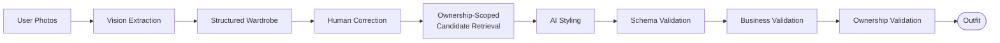
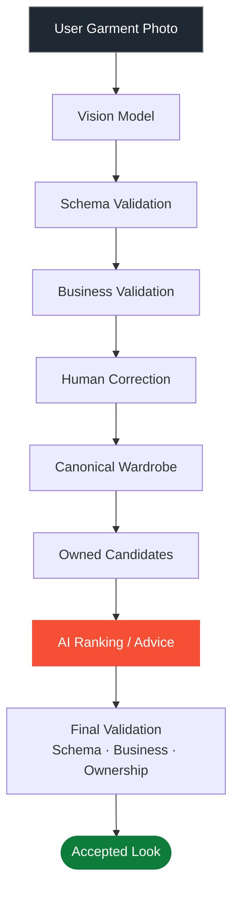
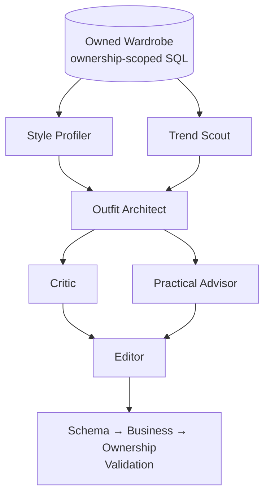
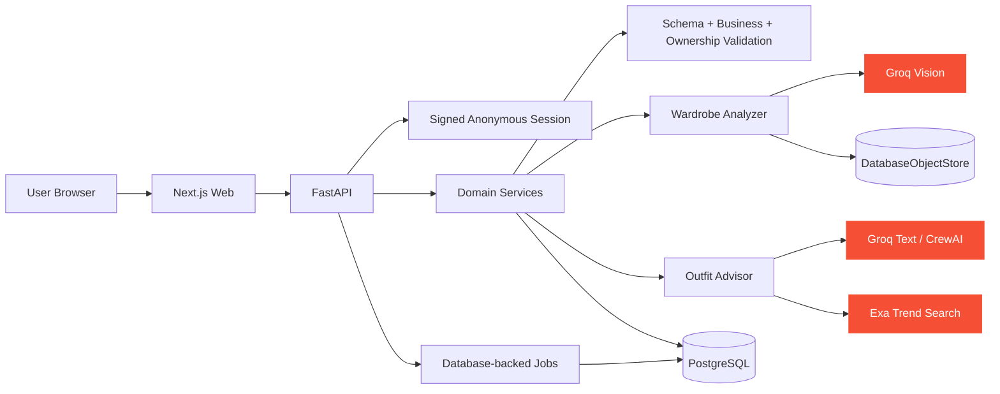
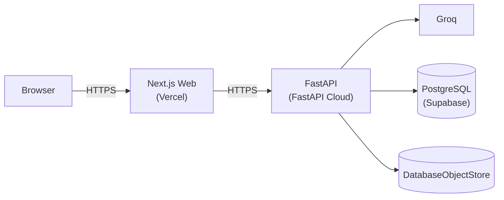

<div align="center">

# STYLELAB

### AI wardrobe intelligence for the clothes you already own

**Upload what you own → AI understands it → you correct its uncertainty → agents compose outfits → swap pieces.**

[**Live Demo**](https://the-style-lab-ai.vercel.app/) &nbsp;·&nbsp; [Architecture](docs/ARCHITECTURE.md) &nbsp;·&nbsp; [AI System](docs/AI-SYSTEM.md) &nbsp;·&nbsp; [Agent Design](docs/AGENT-SYSTEM.md) &nbsp;·&nbsp; [Report a Bug](https://github.com/theShivansh/StyleLab/issues)

[](https://github.com/theShivansh/StyleLab/actions/workflows/ci.yml)
[](LICENSE)
[](docs/PROGRESS.md)
[](docs/AI-EVAL-CASES.md)
[](docs/TESTING.md)

<br/>


</div>

---

STYLELAB turns photographs of clothes you actually own into a structured wardrobe, then generates outfit recommendations **grounded in that wardrobe** never in a catalogue, and never in the model's imagination.

It is deliberately **not** a shopping assistant, a merchant catalogue, or a generic styling chatbot.

> The database knows what you own. The vision model understands garments. You correct uncertainty. A crew of AI agents ranks and explains combinations. The application validates what's allowed to reach the user.

## At a glance

| | |
|---|---|
|  **AI** | Groq-hosted `openai/gpt-oss-120b` (reasoning) + `qwen/qwen3.8-27b` (vision), orchestrated by a 7-role CrewAI crew |
| **Frontend** | Next.js 16 · React 19 · TypeScript · Tailwind CSS 4 · Zustand · Zod |
| **Backend** | FastAPI · Python 3.11 · SQLAlchemy · Alembic · PostgreSQL (Supabase) |
| **Grounding** | Every outfit is re-validated against `user_id`-scoped SQL after the model responds — a model can propose, only the database can confirm ownership |
| **Proof, not vibes** | 709 backend tests · 127 adversarial AI-eval cases · 90 web unit tests · 68 Playwright E2E runs, all in CI |
| **Live** | Web on Vercel, API on FastAPI Cloud, DB on Supabase — [the-style-lab-ai.vercel.app](https://the-style-lab-ai.vercel.app/) |

<br/>

## Table of Contents

- [Why STYLELAB?](#why-stylelab)
- [Product Loop](#product-loop)
- [The Core Differentiator: Grounded AI](#the-core-differentiator-grounded-ai)
- [Human-in-the-Loop AI](#human-in-the-loop-ai)
- [Multi-Agent Advisory Layer](#multi-agent-advisory-layer)
- [Why Not a Generic ReAct Loop?](#why-not-a-generic-react-loop)
- [Trend Grounding](#trend-grounding)
- [AI Reliability — The "No-Gimmick" Layer](#ai-reliability--the-no-gimmick-layer)
- [Failure & Degradation Strategy](#failure--degradation-strategy)
- [Analytics & Product Thinking](#analytics--product-thinking)
- [Engineering Evidence](#engineering-evidence)
- [Security & Privacy](#security--privacy)
- [Architecture](#architecture)
- [Technology Stack](#technology-stack)
- [API Surface](#api-surface)
- [Local Development](#local-development)
- [Deployment](#deployment)
- [Product Decisions](#product-decisions)
- [Current Limitations](#current-limitations)
- [Documentation](#documentation)
- [License](#license)

---

## Why STYLELAB?

Most AI styling experiences share a simple problem:

> The model can recommend something that sounds good but does not exist in your closet.

STYLELAB treats **wardrobe ownership as a product invariant**, not a suggestion.

Instead of:

> "Try a black leather boot."

STYLELAB asks:

> "Which footwear from *this user's actual wardrobe* best completes this look?"

That single reframing changes the architecture end to end:



---

## Product Loop


### 1 · Upload

Multiple garment photos, uploaded at once. Each image is processed as an **independent job** — one bad photo never breaks the rest of the wardrobe capture.

### 2 · Understand

The vision pipeline extracts structured metadata per garment:

- category & subcategory
- color, pattern & visible construction
- fit, sleeve, and formality
- occasion tags
- material *estimate* (never asserted as fact)
- per-field confidence score

### 3 · Correct

AI uncertainty is surfaced, not hidden.

```text
AI:    color = black · confidence = low
User:  "Actually navy."
→      color = navy · source = user_corrected
```

That correction becomes canonical wardrobe state. It is **persistent user feedback**, not online model training the underlying model never changes; the *data it's grounded in* does.

### 4 · Compose

The application retrieves garments the user actually owns. The model ranks and explains those candidates it cannot invent an item that isn't in the retrieved set.

### 5 · Swap

*"What if I change the bottom?"* STYLELAB changes one wardrobe slot while holding the rest of the look constant. The swap path deliberately skips the full advisory crew (Style Profiler, Trend Scout, Critic) and re-runs only the Architect + Editor, so it's fast *and* cheap.

---

## The Core Differentiator: Grounded AI

### The model is not the source of truth.



The LLM produces **untrusted data**. The application decides whether that data is allowed to become a recommendation. A confident model response never becomes an automatic product decision it's a candidate, not a verdict.

---

## Human-in-the-Loop AI

STYLELAB explicitly separates three states of truth:

| State | Meaning |
|---|---|
| **Observed** | What the vision pipeline extracted from the photograph |
| **Inferred** | A model-derived interpretation, carrying explicit uncertainty |
| **User-confirmed** | A value the wardrobe owner explicitly corrected |

```text
Model inference        User correction         Canonical state
color = black    →     "Actually navy."   →    color = navy
confidence = 0.31                               source = user_corrected
```

That corrected state feeds the recommendation system directly. The system never pretends a correction retrains the underlying model it's a durable fact about *this user's wardrobe*, stored where the ownership invariant already lives.

---

## Multi-Agent Advisory Layer

Composition isn't one giant prompt it's seven specialist roles, each independently testable, running behind a single `OutfitAdvisor` interface on top of a Groq-hosted `openai/gpt-oss-120b`, orchestrated with CrewAI.

| # | Agent | Reads | Produces |
|---|---|---|---|
| 1 | **Wardrobe Analyst** | one garment image | structured metadata + per-field confidence |
| 2 | **Style Profiler** | wardrobe + stated preferences | the user's aesthetic, expressed in their own clothes' terms |
| 3 | **Trend Scout** | wardrobe + `TrendSource` (Exa) | dated, sourced trends mapped onto *owned* garments only |
| 4 | **Outfit Architect** | wardrobe + profile + trends | candidate outfit combinations, roles filled |
| 5 | **Critic** | candidates | objections on proportion, palette, occasion, weather |
| 6 | **Practical Advisor** | wardrobe + candidates | styling tips, alternatives, budget tricks, wardrobe gaps |
| 7 | **Editor** | everything above | one merged, schema-valid advisory response |



The parallelism is deliberate the Style Profiler and Trend Scout don't depend on each other, and neither do the Critic and Practical Advisor. Critical path is **4 sequential hops, not 7**.

**Measured latency:** ~8s live for the full six-agent crew end to end, and ~4.4s for the reduced Architect + Editor path used on a swap against a 30-second budget enforced by a circuit breaker that drops to a leaner crew after two consecutive slow responses, and recovers automatically on the next fast one. Every role is an independent variable see [Agent evaluation](#ai-reliability--the-no-gimmick-layer): a role that doesn't materially change the output gets cut.

---

## Why Not a Generic ReAct Loop?

STYLELAB deliberately avoids an unconstrained:

```text
Thought → Action → Observation → Thought → Action → ...
```

The domain already provides deterministic answers that should never be delegated to an LLM:

- ownership
- candidate retrieval
- item existence & item state
- core compatibility constraints

A **bounded orchestration model** buys:

- predictable latency and token usage
- clearer security boundaries
- simpler failure handling
- easier evaluation and debugging

There *is* one bounded refinement loop: the Critic can trigger a single capped revision when its score falls below threshold and it has an actionable objection. That's it. The goal is controlled reasoning, not infinite agent theatre.

---

## Trend Grounding

Trend information is a **styling signal**, never inventory.


> **Trends may rerank garments you own. Trends may never introduce garments you do not own.**

Trend notes without valid attribution are dropped, not rendered. Trend retrieval is optional without a configured Exa key, STYLELAB keeps composing from the wardrobe with reduced advisory depth rather than failing.

---

## AI Reliability : The "No-Gimmick" Layer

STYLELAB tests what happens when the model is **wrong**, not only when it's helpful.

<details>
<summary><strong>Adversarial evaluation categories (click to expand)</strong></summary>

- unowned garment injection
- cross-user garment injection
- IDs outside the candidate set
- malformed JSON
- schema violations
- business-rule violations
- prompt injection
- provider timeout / provider failure
- retry & fallback behavior
- low-confidence extraction
- insufficient wardrobe
- deleted garments
- correction persistence
- multi-agent ablation

</details>

The invariant that has to hold no matter what the model says:

```text
LLM response → Schema validation → Business validation → Ownership validation → Accepted result
```

A model can produce a perfectly formatted answer and still be rejected. That's not a bug it's the point.

---

## Failure & Degradation Strategy

STYLELAB prefers a shallower answer over fabricated confidence:

1. **Full advisory crew** — all seven roles
2. **Crew without Trend Scout** — `TrendSource` unavailable or stale
3. **Architect + Editor only** — latency circuit breaker tripped
4. **Deterministic ranker** — over the same ownership-scoped candidate set
5. **Honest gap statement** — *"your wardrobe needs a bottom for this"* and stop

**AI failure never becomes hallucinated inventory.** The product reduces intelligence depth while preserving the one invariant it refuses to break: never recommend a garment the user doesn't own.

---

## Analytics & Product Thinking

Analytics is treated as part of the architecture, not an afterthought bolted on at the end.

**Funnel:** `Landing → Wardrobe Started → Images Selected → Upload/Rejection → Extraction → Correction → Compose → Outfit Viewed → Swap/Regenerate → Save/Share → Session Completed`

**Diagnostic dimensions on every failure:**

```text
Failure
├── photo validation
├── extraction confidence
├── provider failure
├── schema failure
├── ownership rejection
├── latency
├── missing wardrobe role
└── abandonment
```

This turns "users are leaving" from a vibe into a question with an actual answer: *is AI quality the problem, or is uploading the first five garments too much friction?* Those are very different product problems with very different fixes.

---

## Engineering Evidence

Verified against the repository's own execution ledger ([`docs/PROGRESS.md`](docs/PROGRESS.md)) every row below is test-verified, not claimed.

| Evidence | Value | Status |
|---|---|---|
| Backend tests (pytest) | **709** | Test-verified |
| AI evaluation cases | **127** | Test-verified |
| Web unit tests (Vitest) | **90** | Test-verified |
| Browser E2E (Playwright, desktop + mobile) | **68** | Test-verified |
| Agent ablation suite | **11 tests** | Test-verified |
| Refusal-harness scenarios | **19 / 19** | Test-verified |
| Full six-agent crew, live | **~8.1s** | Measured |
| Reduced crew (Architect + Editor) | **~4.4s** | Measured |

> Latency figures are environment- and provider-dependent treat them as evidence of shape, not a universal benchmark.

### Evidence-based engineering achievements

- **Grounding** — deterministic wardrobe grounding, measured by adversarial ownership tests, by constraining recommendations to server-retrieved candidates and re-validating ownership *after* generation.
- **Human-in-the-loop** — human-correctable extraction, measured by correction-persistence tests, by treating user corrections as authoritative wardrobe state.
- **Async processing** — independent image-failure isolation, measured by async pipeline tests, by running each garment as its own analysis job.
- **Reliability** — provider-failure resilience, measured by retry/fallback and degradation tests, by isolating providers behind explicit adapters.
- **Security** — cross-user refusal behavior, measured by adversarial ownership tests, by making a foreign wardrobe reference a hard failure.
- **Agent evaluation** — multi-agent value validation, measured by the ablation suite, by requiring every retained role to materially change the output.
- **Privacy** — privacy-preserving ingestion, measured by ingest checks, by stripping EXIF metadata GPS included before persistence.

---

## Security & Privacy

Uploaded wardrobe photography is treated as sensitive by default.

- provider secrets stay server-side
- signed, anonymous sessions
- ownership-scoped queries everywhere
- hard cross-user item rejection
- image MIME / size / resolution validation
- EXIF & GPS stripping before persistence
- short-lived image access capabilities
- access-log redaction
- model output always treated as untrusted data
- prompt-injection defenses across three untrusted channels: in-image text, retrieved trend copy, and agent-to-agent messages
- documented deletion & retention behavior
- no inference about the person appearing in a garment photograph

Full detail: [`docs/SECURITY-PRIVACY.md`](docs/SECURITY-PRIVACY.md)

---

## Architecture



Deeper architectural documentation: [`docs/ARCHITECTURE.md`](docs/ARCHITECTURE.md)

---

## Technology Stack

| Layer | Technology |
|---|---|
| Web framework | Next.js 16.3.5 (App Router) |
| UI | React 19.2.8 |
| Language | TypeScript |
| Styling | Tailwind CSS 4 |
| Client state | Zustand |
| Validation | Zod |
| API framework | FastAPI (`fastapi[standard]`) |
| Runtime | Python 3.11 (`>=3.11,<3.13`) |
| ORM / migrations | SQLAlchemy 2 + Alembic |
| AI inference | Groq — `openai/gpt-oss-120b` (text) · `qwen/qwen3.8-27b` (vision, with fallback) |
| Agent framework | CrewAI, on a custom `BaseLLM` transport (testable with no API key) |
| Trend retrieval | Exa + HTTPX |
| Database | PostgreSQL (Supabase) |
| Object storage | `DatabaseObjectStore` |
| Job queue | Database-backed job store (cross-instance safe) |
| Backend testing | Pytest |
| Web unit testing | Vitest + Testing Library |
| Browser testing | Playwright (desktop + mobile) |
| CI | GitHub Actions |
| Hosting | Vercel (web) · FastAPI Cloud (API) · Supabase (database) |

The repo pins `pnpm@10.33.0` and targets Python `>=3.11,<3.13`.

---

## API Surface

<details>
<summary><strong>Key endpoints (click to expand) — full contract in <code>docs/API-SPEC.md</code></strong></summary>

| Method | Path | Purpose |
|---|---|---|
| `POST` | `/session` | Issue a signed anonymous session |
| `POST` | `/wardrobe/items` | Upload garment photo(s) for extraction |
| `GET` | `/jobs/{job_id}` | Poll an async extraction/composition job |
| `GET` | `/wardrobe/items` | List the caller's wardrobe |
| `GET` | `/wardrobe/items/{item_id}` | Fetch one garment |
| `PATCH` | `/wardrobe/items/{item_id}` | Apply a user correction |
| `POST` | `/wardrobe/items/{item_id}/reanalyze` | Re-run extraction on one garment |
| `DELETE` | `/wardrobe/items/{item_id}` | Delete one garment |
| `DELETE` | `/wardrobe/items` | Delete the whole wardrobe |
| `GET` | `/wardrobe/items/{item_id}/extractions` | Extraction history / audit trail |
| `POST` | `/outfits/compose` | Run the advisory crew, get a ranked outfit |
| `GET` | `/outfits/{outfit_id}` | Fetch a composed outfit |
| `GET` | `/outfits/{outfit_id}/alternatives?role=bottom` | Alternatives for one slot |
| `POST` | `/outfits/{outfit_id}/swap` | Swap one slot (Architect + Editor only) |
| `POST` | `/outfits/{outfit_id}/save` | Save/share an outfit |
| `GET` | `/assets/{asset_id}/{token}` | Short-lived, capability-scoped image access |

</details>

---

## Local Development

### Requirements

- Node.js 22+
- pnpm 10+
- Python 3.11
- PostgreSQL
- Groq API key (there is no demo mode — the app performs real inference)

### Install

```bash
pnpm install

python -m venv .venv

# Windows
.\.venv\Scripts\python -m pip install -e "apps/api[dev]"

# macOS / Linux
# .venv/bin/python -m pip install -e "apps/api[dev]"
```

### Database

```bash
cd apps/api
alembic upgrade head
```

### Run

```bash
pnpm dev
```

### Web checks

```bash
pnpm lint
pnpm typecheck
pnpm test:unit
pnpm test:e2e
pnpm build
```

### Python checks

```bash
.\.venv\Scripts\python -m ruff check apps/api tests
.\.venv\Scripts\python -m pytest apps/api/tests -q
```

### AI evaluation, no provider credentials required

```bash
python tests/ai/runner.py --response path/to/model-response.json
```

Deterministic AI evaluation runs against test adapters that satisfy the same interfaces as the real providers. The running application never silently falls back to those doubles — see [`docs/AI-SYSTEM.md`](docs/AI-SYSTEM.md).

---

## Deployment



**Required production configuration:**

```text
APP_ENV=production
GROQ_API_KEY
DATABASE_URL
SESSION_SECRET
WEB_ORIGIN
```

**Trend functionality additionally needs:**

```text
EXA_API_KEY
```

Full deployment contract, including platform-specific gotchas discovered by actually shipping (not just reading the docs): [`docs/DEPLOYMENT.md`](docs/DEPLOYMENT.md)

---

## Product Decisions

<details>
<summary><strong>Why these choices (click to expand) — full log in <code>docs/DECISIONS.md</code></strong></summary>

**User-owned wardrobe over a seeded catalogue** — a seeded catalogue makes demos easier but weakens the core product proposition. STYLELAB starts with the user's actual clothing.

**No demo mode** — the user-facing app always calls the configured AI provider; mocks exist only for testing and evaluation.

**AI ranks; software owns truth** — ownership and candidate retrieval stay fully deterministic, outside the model's reach.

**Bounded agents over open-ended autonomy** — every agent role has to demonstrate measurable value or it gets cut (see the ablation suite).

**Live trends over a stale trend corpus** — trend information is retrieved, filtered, and attributed at request time rather than baked into a static corpus.

**No core virtual-try-on dependency** — the primary experience stands on its own without VTO.

**Planner deferred** — intentionally out of scope for now; the cold-start funnel analytics were kept anyway because they're useful independent of the planner shipping.

**Anonymous session over full authentication** — avoids account friction for a portfolio flow while preserving a signed identity boundary that can later be swapped for stronger auth.

</details>

---

## Current Limitations

This repository is intentionally honest about what's unfinished:

- Full user authentication is not implemented.
- Rate limiting is currently per-instance, not shared/distributed.
- Retention sweeping needs scheduled execution as the service scales to zero.
- CSP nonce hardening remains open (`script-src 'unsafe-inline'` is real, and named as a gap rather than hidden).
- Exa trend retrieval is optional, not guaranteed.
- Provider quotas affect some live-test/demo timing.
- Real-user business KPI percentages are not claimed anywhere in this repo.
- The planner remains disabled: `flags.planner = false`.

---

## Documentation

| Document | Purpose |
|---|---|
| [`docs/ARCHITECTURE.md`](docs/ARCHITECTURE.md) | System architecture |
| [`docs/AI-SYSTEM.md`](docs/AI-SYSTEM.md) | AI pipeline specification |
| [`docs/AI-EVAL-CASES.md`](docs/AI-EVAL-CASES.md) | Adversarial AI test cases |
| [`docs/AGENT-SYSTEM.md`](docs/AGENT-SYSTEM.md) | Multi-agent architecture |
| [`docs/ANALYTICS.md`](docs/ANALYTICS.md) | Funnel + KPI model |
| [`docs/API-SPEC.md`](docs/API-SPEC.md) | Full API contracts |
| [`docs/DATA-MODEL.md`](docs/DATA-MODEL.md) | Persistence model |
| [`docs/SECURITY-PRIVACY.md`](docs/SECURITY-PRIVACY.md) | Security + privacy |
| [`docs/DEPLOYMENT.md`](docs/DEPLOYMENT.md) | Deployment contract |
| [`docs/DECISIONS.md`](docs/DECISIONS.md) | Product/engineering decision log |
| [`docs/PROGRESS.md`](docs/PROGRESS.md) | Execution + verification ledger |
| [`docs/OBSERVABILITY.md`](docs/OBSERVABILITY.md) | Generation telemetry |


---


## License

MIT — see [`LICENSE`](LICENSE).

<div align="center">

If STYLELAB's approach to grounded, validated AI is useful to you, a ⭐ on the repo helps others find it.

</div>
